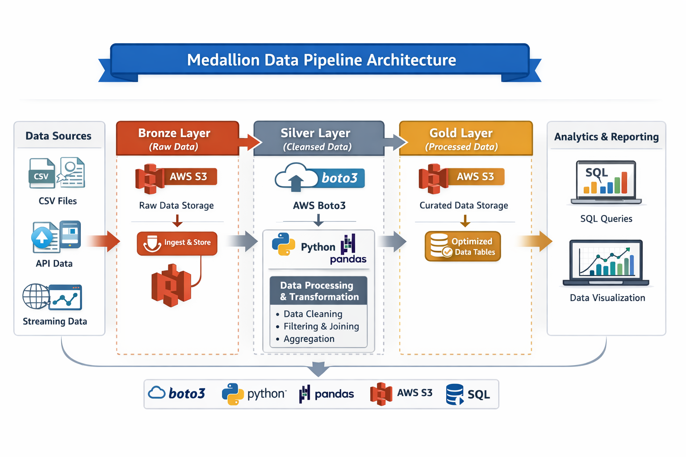

# tokyo-olympics-data-pipeline
#  Tokyo Olympics 2020 – Data Engineering Project

---

##  Project Overview

This project processes and cleans the Tokyo Olympics 2020 dataset using Python and AWS S3.  
The objective is to transform raw CSV data into structured, analysis-ready datasets using data engineering practices.

##  Architecture Diagram

---

##  Tools & Technologies Used

| Category        | Tool / Technology | Purpose                                |
|-----------------|------------------|----------------------------------------|
| Programming     | Python           | Data processing & transformation       |
| Data Library    | Pandas           | Data cleaning & manipulation           |
| Cloud Storage   | AWS S3           | Store raw & cleaned datasets           |
| Version Control | Git              | Track project changes                  |
| Repository      | GitHub           | Project hosting & documentation        |
| Data Format     | CSV              | Structured dataset storage             |

---

##  Dataset Categories

| File Name                 | Category              | Description                              |
|---------------------------|----------------------|------------------------------------------|
| athletes.csv              | Participants Data     | Athlete details                          |
| coaches.csv               | Support Staff Data    | Coach information                        |
| medals.csv                | Medal Records         | Individual medal data                    |
| medals_total.csv          | Aggregated Results    | Country-wise medal totals                |
| technical_officials.csv   | Officials Data        | Event officials information              |

---

##  Data Cleaning & Processing Steps

| Step | Operation                              | Purpose                          |
|------|----------------------------------------|----------------------------------|
| 1    | Removed duplicate records              | Improve accuracy                 |
| 2    | Converted column names to lowercase    | Maintain consistency             |
| 3    | Validated null values                  | Ensure clean dataset             |
| 4    | Uploaded cleaned files to AWS S3       | Cloud storage integration        |

---

##  Future Enhancements

- Automate ETL pipeline using AWS Glue
- Query data using AWS Athena
- Load data into AWS Redshift
- Build dashboard using Power BI or Tableau
- Implement CI/CD for deployment

----

##  Author

**Adepu Sriharsha**  
B.Tech Final Year Student  
Aspiring Data Engineer
